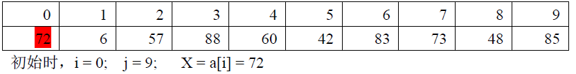
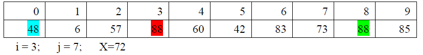

# 快速排序
- 简称：快排
- 由来
	- 快速排序由 C. A. R. Hoare（东尼霍尔，Charles Antony Richard Hoare）在1962年提出
- 地位
	- 号称最快的排序算法。理论上是最快的排序算法中的一个。实验上是最快的，我在实验室工作的时候，有同事查到文献，那篇文献的作者使用主流排序算法进行了上万次的实验，结果是快排的确是最快的没有之一
- 面试
	- 程序员面试题经常经常被提及。
	- 原因
		- 思想：分而治之的思想好
		- 难度：难度够大有一定的区分度
- 思想
	1. 选数：从数列中取出一个数，作为基准数（标杆数）
	2. 分区：把数列中所有小于基准数的放到这个数的左侧，所有大于这个数的放到其右侧
	3. 迭代：把左侧数列视为一个新的数列，把右侧数列视为一个新的数列，分别再次开启快排算法
	4. 退出：当每一个区域都只有一个数的时候，算法结束
- 运算过程
	- 一句话： 挖坑填数 + 分治法
	- 运算过程：
		1. 初始状态，选数
			- 
			 我们现在将 a[0] 保存到了临时变量 X 中（X 就是基准数，目前是72）。 于是，我们可以认为我们在 a[0] 这个位置挖了一个坑，以后可以随时来填这个坑，数据绝不会丢失
		2. 分区			
			- 从右侧开始，我们找到第一个大于等于基准的数。具体找法就是 j--； 遍历每一个数据。于是，我们找到了 48(也就是 a[j]，j==8 )，我们意识到48小于基准数（72），它应该出现在左侧区域，于是，我们用48去填我们已经挖好的坑（也就是用48去覆盖72）。此时，我们填好了一个坑，也就同时挖出了一个新的坑，这个新的坑就是 a[j](即,a[8])。注意，此时程序的状态： i=0, j=8, X=72, 坑的位置=a[8]  
			- 当右侧指针（即，j）已经挖好了一个坑之后，我们让 j 休息一下。现在开始从左往右前进，试图让 i 也挖一个坑。让 i 一路向右探测，找到第一个大于基准（72）的数。这个数是88（a[3]）。 于是，我们知道 88 应该出现在右区，那么我们用 88 去填目前存在的坑（a[8]），于是，a[8]被填满了，同时，我们又挖好了一个新的坑 a[i](即，a[3])。注意，此时程序状态：i=3, j=8, X=72, 坑的位置=a[3]。  
			    
			- 现在，i 刚刚挖好了一个坑，让 i 休息一下，再 j 出来继续干活。 （规律：先从后向前找，然后，从前向后找）
			- j 从后向前找（j--），一路走一路找，第一个找到的小于 基数（72）的是 42（即，a[5]）。于是，我们把 42 挖出来，填到上一个坑里（当前坑的位置=a[3]）。我们填好一个坑的同时也就挖了另一个坑 a[5] 。
			- 现在 j 已经挖好一个坑了，那么，让 j 休息一下，让 i 出来干活。目前， i=3。 我们让 i 继续向右寻找（i++）。在 i 一路向右的过程中，i 碰到了 j（i 与 j 胜利会师，即，i == j ）。 此时，i 与 j 同时指向了目前队列中的坑。当 i==j 的时候，我们就可以把之前存起来的基数种到这个坑里了。 此时，我们完成了分区。
		3. 迭代
			- 
			我们再观察目前数列的状态，事实上，我们就已经成功做到了分区，基数左侧的区域一定都是 小于 基数的，基数右侧的区域一定都是 大于 基数的。 
			- 我们单独拿出左侧区域来看，这又是一个新的数列，我们可以对这个数列再次实施 快速排序。
			- 对于右侧区域也是一样，我们可以对这个数列再次实施 快速排序。
	- 归纳
		1. 令i =L; j = R; 将a[i]挖出形成第一个坑，称a[i]为基准数。
		2. j--由后向前找比基准数小的数，找到后挖出此数填入前一个坑a[i]中
		3. i++由前向后找比基准数大的数，找到后也挖出此数填到前一个坑a[j]中
		4. 重复进行这种“挖坑填数”直到i==j。再将基准数填入a[i]中
		5. 这样i之前的数都比基准数小，i之后的数都比基准数大。因此将数组分成二部分再分别重复上述步骤就完成了排序。

-	总结
	-	实践证明，快速排序是所有排序算法中最高效的一种。它采用了分治的思想：先保证列表的前半部分都小于后半部分，然后分别对前半部分和后半部分排序，这样整个列表就有序了。这是一种先进的思想，也是它高效的原因。因为在排序算法中，算法的高效与否与列表中数字间的比较次数有直接的关系，而"保证列表的前半部分都小于后半部分"就使得前半部分的任何一个数从此以后都不再跟后半部分的数进行比较了，大大减少了数字间不必要的比较。

课外阅读：
快排： http://developer.51cto.com/art/201403/430986.htm